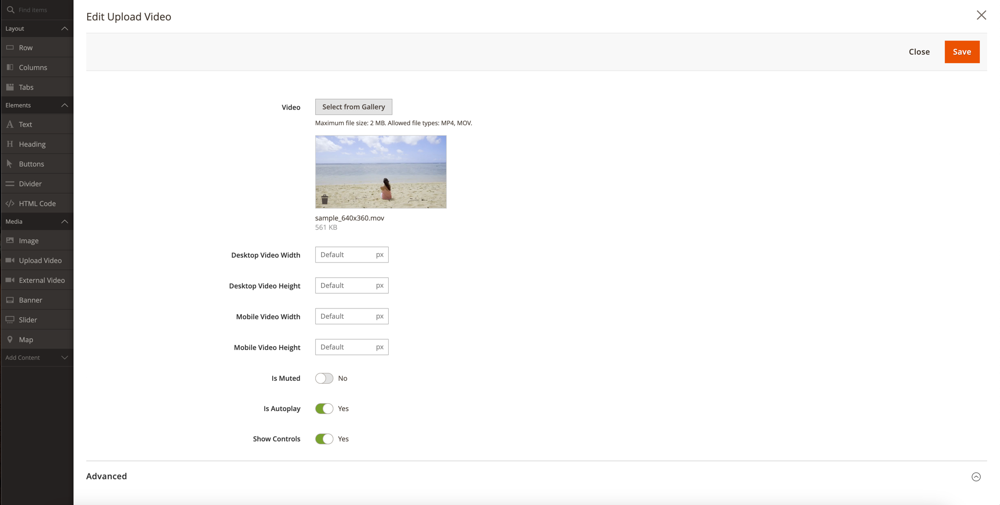
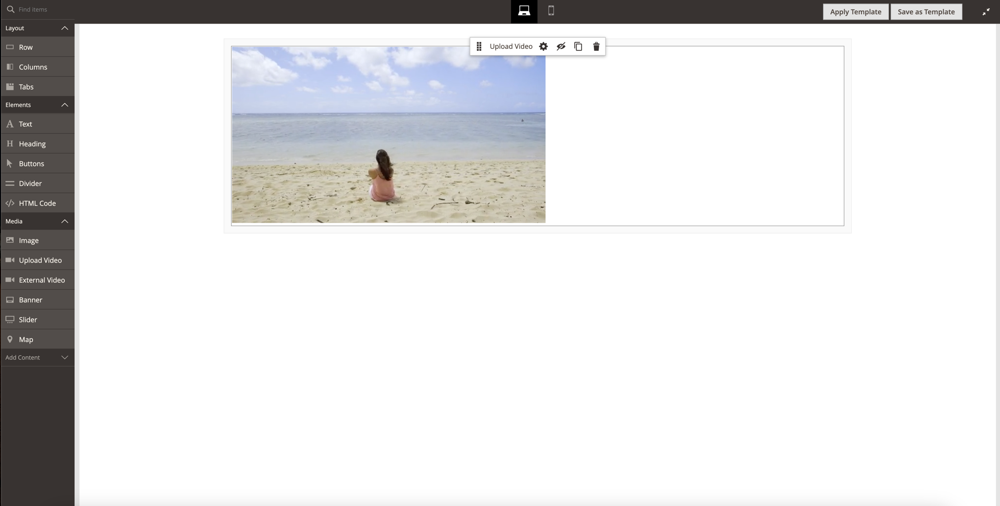
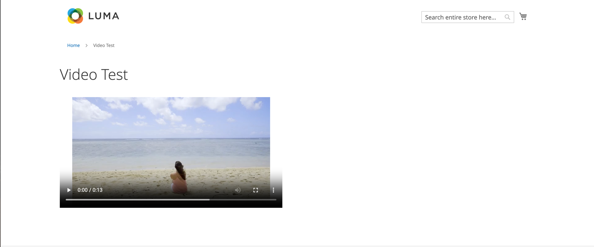

# Magento 2 Video Wysiwyg Extension

## Requirements
* Magento 2.0.0-2.4.x

## Overview
Let your administrators upload videos using 
Media Gallery and insert them to the pagebuilder content (CMS Blocks, CMS Pages) using new content type "Upload Video"

## Main Features
* Upload .mov and .mp4 video formats from Magento Admin
* Use native \<video> HTML tag to show video content
* Configure Autoplay, Controls and Mute options using Pagebuilder
* Separated viewport configuration - Mobile and Desktop view
* 1:1 Content type preview in pagebuilder

## Supported Formats
* mp4
* mov

## Installation
```bash
composer require halexm2/video-wysiwyg
bin/magento setup:upgrade
```
## Screenshots
### Content Type Configuration


### Content Type PageBuilder Preview


### Content Type Frontend Preview

